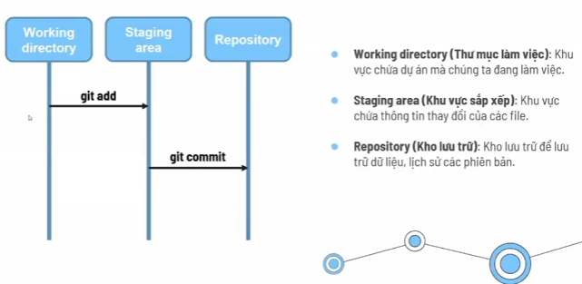
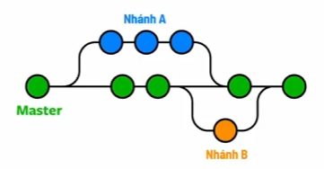

<h1>1. Gồm có 3 vùng cơ bản:</h1>
    
- Working Directory: Khu vực chứa dự án code đang làm việc

- Staging Area: Khu vực chứa thông tin thay đổi của file

- Repository: Kho lưu trữ để lưu trữ dữ liệu, lịch sử của phiên bản

<h1>2. Các câu lệnh Git sử dụng phổ biến</h1>  

___git init___

- Khởi tạo repository cho dự án
- Chạy câu lệnh trong thư mực gốc của dự án  

___git status___ 

- Để xem trạng thái của những file đã được thay đổi trong dự án
- Màu đỏ là file vẫn còn nằm trong vùng Working
- Màu xanh là đã sang vùng Staging
- Nếu sửa content của file khi file đang ở vùng Staging thì nó sẽ đẩy ngược về lại vùng Working

___git add ten_file hoặc git add .___  

- git add . thì tất cả file đang ở vùng Working sẽ sang vùng Staging
- Chuyển các file đã thay đổi từ vùng Working sang vùng Staging
- Staging area có tác dụng sắp xếp lại các file đã thêm vào  

___git commit -m "Nội dung...."___

- Chuyển file ___từ vùng Staging sang vùng Repository___
- Repository có tác dụng tạo ra 1 phiên bản mới
- Khi commit, lệnh git status sẽ hiện ra
>On branch master  
>nothing to commit, working tree clean

___git log___  

- Xem lại lịch sử các commit (Commit mới sẽ hiện ở trên, cũ là ở dưới)  

___git show commit_id___

- Dùng để xem chi tiết 1 commit  

___git diff___  
- Xem sự thay đổi của 1 file sau khi chỉnh sửa
- Điều kiện là file đó vẫn đang ở khu vực ___Working___  

___gitk___  
- Mở dashboard xem trực quan hơn  

___git checkout --ten_file___  
- Bỏ đi những thay đổi của file, để file đó trở về như lúc ban đầu, áp dụng khi đang code giữa chừng mà không biết lỗi ở đâu thì nên xóa các đoạn code mới
- Áp dụng cho file đang ở vùng Working  

___git reset HEAD ten_file hoặc git reset ten_file___  
- Chuyển file từ vùng Staging về Working  

___git reset --soft commit_id___  
- Chuyển trạng thái từ vùng Repository về lại vùng Staging, tức là lỡ commit mà thấy code lỗi quá thì dùng lệnh này nó sẽ trả về lại trước lúc commit

___git reset --mixed commit_id___  
- Chuyển từ trạng thái đã commit về trạng thái trước lúc chạy lệnh git add
- Tức là từ Repository về lại Working  

<h1>3. Nhánh trong Git</h1>  
- Các nhánh đại diện cho các phiên bản của 1 kho lưu trữ tách ra từ dự án chính
- Nhánh master là nhánh chính để sau này deploy lên server  

)

<h2>3.1. Các câu lệnh nhánh trong Git</h2>  

___git branch___  
- Xem danh sách các nhánh  

___git checkout -b ten_nhanh___  
- Tạo 1 nhánh mới và chuyển sang nhánh đó  

___git checkout ten_nhanh___  
- Chuyển sang nhánh khác  

___git merge ten_nhanh___  
- Để merge nhánh khác vào trong nhánh hiện tại  

___git branch -D ten_nhanh___  
- Để xóa nhánh  

<h1>Deploy code lên vercel</h1>