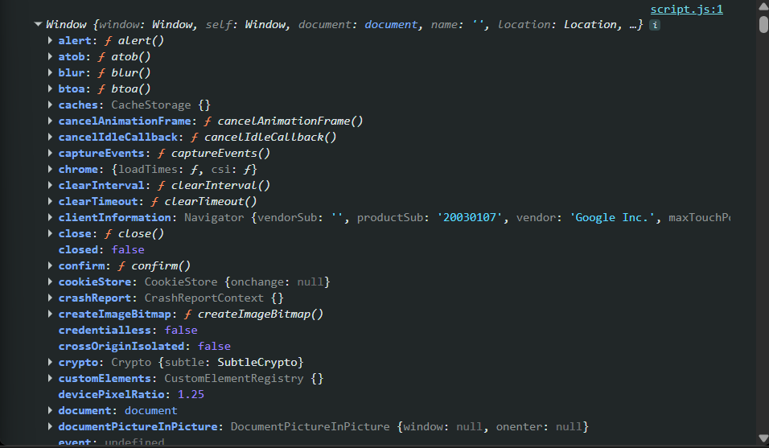

<h1>Khái niệm về BOM (Browser Object Model)</h1>  

- Là các đối tượng liên quan đến trình duyệt, dùng để tủy xuất lịch sử lướt web, lưu các hành động và trạng thái, thông tin của người dùng  
- Các loại BOM:
> - window  
> - screen  
> - location  
> - navigator  
> - history  
> - popup  
> - timing  
> - cookies  

<h2>BOM Window</h2>  

- Window là 1 __đối tượng__ có những __phương thức__ và __thuộc tính__ được dùng để xử lý trong trình duyệt  
- window có __cấp độ cao nhất__  
- Gồm các hàm built in như alert, blur,...  
  
- Có thể hình dung như sau:  
```javascript
const inforUser = {
    name: 'Le van A',
    renderName: () =>{
        console.log('OK')
    }
}
inforUser.renderName() // in ra chữ Ok
```  
- Window cũng tương tự như vậy, nhưng có thể gọi thẳng alert thay vì window.alert  
- window.innerWidth và window.innerHeight: dùng để lấy kích cỡ trang tài liệu của người dùng đang dùng  
- window.open(url, name, options): dùng để mở một cửa sổ mới, trong đó:  
    url: đường dẫn website muốn mở  
    name: tên đặt cho cửa sổ  
    options: một chuỗi các thông số cách nhau bởi dấu phẩy (height, width, top, left, ....)  
- window.close(): đóng cửa sổ  

<h1>BOM Screen</h1>  

- screen.width: để lấy chiều rộng màn hình máy tính  

- screen.height: để lấy chiều cao màn hình máy tính   

- KHÔNG PHẢI KÍCH THƯỚC MÀN HÌNH TRÌNH DUYỆT  

<h1>BOM Location</h1>  

- location là một đối tượng dùng để xử lý các vấn đề liên quan đến URL của trình duyệt  

- Phương thức: reload(),... 

    >hash: lấy phần sau dấu # của URL  
    >host: lấy hostname và port của URL  
    >hostname: lấy tên host (không lấy ra port)  
    >href:: lấy toàn bộ URL  
    > origin: rear về protocol, hostname và port của URL  
    >pathname: lấy path name của URL  
    >port: lấy port của URL   
    >search: lấy phần query string của URL (sau dấu ?)  

<h1>BOM History</h1>  

- history: dùng để truy vết lịch sử lướt web  

- Lệnh:  

    >history.length(): đếm tổng số trang đã lưu trong history  
    >history.back(): trở về trang trước  
    >history.forward(): đến trang kế tiếp  
    >history.go(number): tới một trang cụ thể  

<h1>BOM Navigator</h1>  

- Dùng để lấy thông tin liên quan đến trình duyệt của người dùng  

- Các thuộc tính:  
    >navigator.cookieEnabled: Để kiểm tra trình duyệt có bật Cookie hay không  
    >navigator.appName: Để kiểm tra tên trình duyệt  
    >navigator.appCodeName: Để kiểm tra tên mã code của trình duyệt  
    >navigator.appVersion: Để kiểm tra version của trình duyệt  
    >navigator.platform: Xem hệ điều hành mà người dùng đang sử dụng  
    >navigator.language: Để kiểm tra ngôn ngữ của trình duyệt  

<h1>BOM Popup</h1>  

> alert  
> confirm  
> propmt  

<h1>BOM Timing</h1>  

> setTimeout  
> setInterval  

<h1> Cookies </h1>  

- Cookie là dữ liệu được lưu trữ trong 1 file nằm trong máy tính  
- Cookie được lưu trữ ở dạng name = value  
- __Cú pháp tạo Cookies__:  
```javascript
    document.cookie = 'name=value'
```  
- __Hàm thiết lập giá trị cookie__:  
```javascript
    function setCookie(cname, cvalue, exdays){
        var d = new Date()
        d.setTime(d.getTime() + (exdays * 24 * 60 * 60 * 1000))
        var expires = 'expires=' + d.toUTCString()
        document.cookie = cname + '=' + cvalue  + ';' + expires
    }
```  

- __Lấy giá trị Cookie__:  
```javascript
    var res = document.cookie
```  
- __Hàm lấy giá trị cookie__:  
```javascript
function getCookie(cname) {
    var name = cname + "=";
    var ca = document.cookie.split(";");
    for (var i = 0; i < ca.length; i++) {
        var c = ca[i];
        while (c.charAt(0) == " ") {
            c = c.substring(1);
        }
        if (c.indexOf(name) == 0) {
            return c.substring(name.length, c.length);
        }
    }
    return "";
}
```  

- __Đổi giá trị Cookie__:  
```javascript
    document.cookie = "name=value";
```  

- __Xóa cookie__:  

- Chỉ cần xét lại giá trị ngày hết hạn về thời gian trước  
- __Cú pháp__:  
```javascript
    document.cookie = "name=; expires=Thu, 01 Jan 1970 00:00:00 UTC";
```  
- __Hàm để xóa 1 cookie__:  
```javascript
function deleteCookie(cname) {
    document.cookie = `${cname}=; expires=Thu, 01 Jan 1970 00:00:00 UTC`;
}
```  


